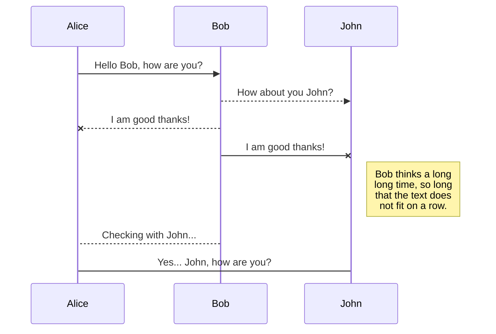
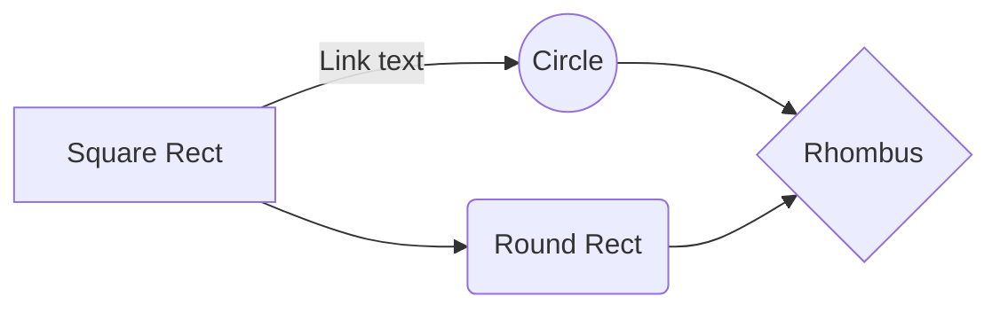

# Backend-project

## Circus Database

In this project you can find a **Rest API** made in Node.js, using Express as the application framework, leveraging a NoSQL database - MongoDB - as means of storing the data.

Here you can **C**reate, **R**ead, **U**pdate or **D**elete data - CRUD. These functions give you the possibility to manage the data in the DataBase, which has all the information about, in this case in particular, a Circus :circus_tent:

---
 
### Getting started
<!-- 
First, after you downloaded this project, in the proper folder, you can run the command "npm install" to install all the dependencies found at package.json file. Then, to run the mongoDB server, you need to write the following code in your terminal:
**`mongod --config /usr/local/etc/mongod.conf`**
now, in other terminal window, navigate to the folder where you have this project, run the command "npm run start" to start the Express Server. -->

#### Step-by-step
1. Download the project;
1. **"`npm install`"** - instalation of dependencies;
1. **`npm run start`** - Express Server;
1. **`mongod --config /usr/local/etc/mongod.conf`** - MongoDB Server

 
 
<!-- In this REST API, information about a circus is managed, which employs several people, all of them with some particularities that make them unique and special. -->

### Database Document example

In this object you can see the form of a JSON document that populates the "Locations" Collection:
```
{
"name": "wonder woman",
"particularity": "The one and only, the One with unusual Strength",
"shows": [
"Men lifting",
"juggling with cars",
"wrestling with lions"
],
"date_of_submission": 1867,
"birthday": 1848,
"__v": 1
}

```

***

### API Paths  


- #### **POST :** ```/locations```  
This method allows the creation of a new location Document in the Locations collection

**Request example:**
```
{
	"city": "Lisbon",
	"country": "Portugal"
	"population_density": 1234567890,
	"age_average": 43.8,
}
```
**Response:**
Status: 201


- **GET :**  **```/locations```** 
With this endpoint we can see all documents of Locations collection.
**Response:** 
```
{
	...
	{
		"city": "Lisbon",
		"country": "Portugal"
		"population_density": 1234567890,
		"age_average": 43.8,
	}
	...
}
```

- **PATCH:** **```/locations/{id}```** 
**id:**		 |  String	  |  	 required
Pass a JSON with the properties you want to upload, of the document with the respective id.
```
{
	"city": "Faro"
}
```
**Response:** 
```
{
	"city": "Faro",
	"country": "Portugal",
	"population_density": 1234567890, 
	"age_average": 43.8,
}
```
- **DELETE** **```/locations/{id}```** 
This path will delete from DataBase the document with respective id that you pass in the Endpoint
**Response:** 
Status: 200
Message: "Location {...} was deleted from DataBase, and the Circus will not act there."

- **GET:** **`/locations/{id}`** 
**id:**		 |  String	  |  	 required
This will return one document from the Locations collection that have that correspondent ID from the Endpoint, like in the following example:

```
{
	"data": {
		"_id": "628416006659f4083e5487a8",
		"city": "Albergaria",
		"country": "Portugal",
		"population_density": 60,
		"age_average": 43.8,
		"__v": 0
	}
}
```
***


##### Author Contacts:

- :e-mail: : nunomvmf@gmail.com

- You can give me some feedback :thumbsup:

- :moneybag: you can send me money if you want :relieved: :smirk:


---

## UML diagrams

You can render UML diagrams using [Mermaid](https://mermaidjs.github.io/). For example, this will produce a sequence diagram:



And this will produce a flow chart:

